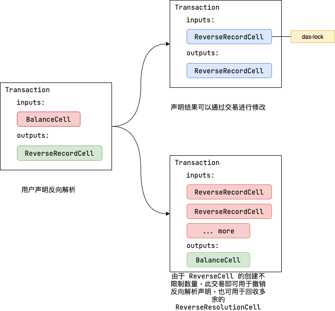

# Reverse Resolution Mechanism

## Terminology
* Address: Refers to a CKB wallet address.
* Private Key: Refers to a CKB wallet private key.
* DAS: Abbreviation for Decentralized Account System.
* Account Name: Refers to the account name in DAS, such as someone.bit.
* Forward Resolution: Refers to obtaining an address using an account name.
* Reverse Resolution: Refers to obtaining an account name using an address.
* Action: For communication and description convenience, each CKB transaction in DAS will have a field to describe its intent, referred to as Action.
* xxx Transaction: Here, xxx represents Action, and the specific transaction structure can be found in the document (todo).

## Requirements
- Any account name should be able to set a reverse resolution record.
- Only those who hold the private key corresponding to the address can set a reverse resolution.
- An address should only resolve to one account name, while an account name can resolve to multiple addresses, meaning it's an n:1 relationship between addresses and account names.
- Support reverse resolution for multi-chain addresses.
- Verify the correctness of reverse resolution through forward resolution.

## Risks to Address
1. The same address may set reverse resolution to multiple different account names.
2. The same address may repeatedly set reverse resolution to the same account name.
3. Third parties may set reverse resolution to a personal account name, or such situations may occur due to account ownership transfer.

## Solution

### Transactions

- First, users declare reverse resolution through the DeclareReverseResolution transaction. During declaration, they need to select a Cell in an address they want to declare reverse resolution for as input. The created ReverseRecordCell can only have the same address as the input Cell.
- After declaration, users can modify the reverse resolution by using the RedeclareReverseResolution transaction to update the ReverseRecordCell.
- After declaration, users can retract the reverse resolution by using the RetractReverseResolution transaction, effectively destroying the ReverseRecordCell. Since the creation of ReverseRecordCell may be repeated, multiple ReverseRecordCells can be used as input here.

### Reverse Resolution

There are no restrictions on different addresses when declaring reverse resolution. For example, any address can declare its reverse resolution record as `alice.bit`. Therefore, the first convention for reverse resolution is:

> Reverse resolution is considered invalid unless it can be obtained through forward resolution.
>
> Forward resolution takes the value in the address namespace, as well as the owner and manager addresses of the account, as the basis for judgment.

Multiple ReverseRecordCells may exist for the same address, and the contract does not guarantee their uniqueness. Therefore, the second convention for reverse resolution is:

> For multiple reverse resolution records for the same address, use the one with the highest block height.
>
> If multiple ReverseRecordCells have the same block height, use the one with the highest transaction index in the block.

## Constraints

### Resolution Records Must Be Cleared During Account Transfer

Scenario: User A registered the account name vvvvv.bit for celebrity V and set a forward resolution record pointing to A's own ETH address 0x1234. Later, the account name vvvvv.bit was transferred to celebrity V's ETH address 0x0000. Since celebrity V has never used the CKB chain, they are unaware of this. However, user A can now use the address 0x1234 as vvvvv.bit and when other users discover that the holding address of vvvvv.bit is indeed 0x0000, they are more likely to mistakenly believe that 0x1234 is indeed another address of celebrity V.
